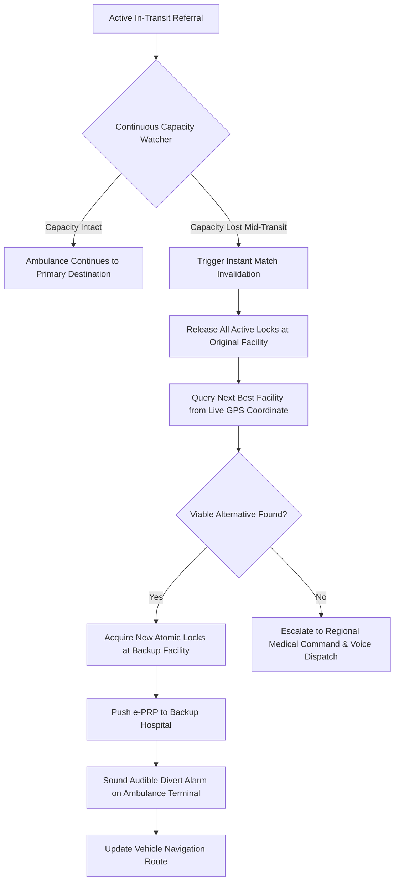

# ReferralOS: Edge Cases, Failover Protocols & System Resilience

## 1. Overview

ReferralOS treats a medical referral not as a static decision, but as a live, continuous state machine that actively adapts to real-world volatility. This document details the failover protocols, distributed race condition handling, lock timeouts, and offline resilience strategies designed into the system.



---

## 2. Mid-Transit Capacity Failure & Automated Rerouting

### 2.1 The Failure Event
While an acute referral is in transit, the destination facility may lose critical clinical capability:
- Operating theatre sterile ventilation failure or contamination.
- On-duty specialist emergency (e.g., surgeon collapses or is called into an unscheduled open-heart trauma).
- Oxygen manifold depletion or primary generator failure.
- Influx of unexpected mass casualties occupying all resuscitation bays.

### 2.2 Invalidation & Automated Reroute Protocol
1. **Event Detection:** The hospital staff toggles the resource offline, or an IoT telemetry sensor detects a failure. A `capacity.resource.status_changed` event is emitted.
2. **Reservation Correlation:** The **Failover Watcher** service queries all active reservations containing the failed resource ID within < 50 milliseconds.
3. **Lock Invalidation:** The affected reservation transitions from `ACTIVE` to `INVALIDATED`. Any accompanying non-failed resources (e.g., resuscitation bed, blood units) at that hospital are released immediately back into the facility pool.
4. **Dynamic Rescoring from Current GPS:** The matching engine triggers an automated re-run using the **live GPS coordinates of the ambulance** as the new origin point.
5. **Secondary Lock Acquisition:** The engine locks the required clinical bundle at the next best viable facility (e.g., Hospital C).
6. **Electronic Handshake Transfer:** The e-PRP is pushed immediately to Hospital C's triage screen with a high-priority audible siren.
7. **In-Vehicle Driver Alert:** The ambulance tablet issues an audible spoken instruction and visual alert:
   > *"URGENT REROUTE: Destination changed to Hospital C (19 min ETA). Navigation route updated."*

---

## 3. Lock Expiry, Traffic Delays & TTL Extensions

### 3.1 The Risk of Premature Lock Expiry
Reservations have a default Time-to-Live (TTL) of 45 minutes to prevent resources from being held indefinitely if a transfer is cancelled. However, ambulances can experience unexpected highway blockages, bridge closures, or vehicle breakdowns.

### 3.2 Dynamic Lease Renewal Protocol
- The **Transport & Tracking Engine** tracks the ambulance's velocity and remaining distance.
- When $T_{\text{ETA}} > T_{\text{lock\_expire}} - 10\text{ minutes}$, the system triggers an **Automated Lease Extension Request**.
- If the destination facility's emergency queue allows, the lock is extended by an additional 20 minutes (`POST /api/v1/reservations/{id}/extend`).
- If the destination facility rejects the extension due to extreme inward patient volume, the Failover Watcher proactively initiates an orderly reroute to a secondary facility *before* the ambulance arrives at a locked-out emergency department.

---

## 4. Race Conditions & Simultaneous Lock Contention

### 4.1 The Scenario
Two primary health centres simultaneously submit referrals for two critical patients (e.g., severe postpartum haemorrhage and acute ruptured appendicitis) who both require the single remaining emergency operating theatre in the regional cluster.

### 4.2 Distributed Mutual Exclusion (Redis Redlock)
- ReferralOS utilizes distributed locks via Redis Redlock across independent Redis nodes.
- Lock acquisition uses atomic test-and-set commands:
  ```text
  SET lock:facility_01:theatre_03 <uuid> NX PX 45000
  ```
- **Execution:**
  - Referral 1 arrives at `t = 0ms` and acquires the lock key.
  - Referral 2 arrives at `t = 4ms` and receives an atomic lock acquisition failure (`409 Conflict`).
  - The matching engine catches the conflict invisibly to the referring clinician, eliminates Facility 1 from Referral 2's candidate pool, and reserves the second-ranked facility in < 80 milliseconds.
  - Double-booking is mathematically precluded.

---

## 5. Offline Resilience & Low-Connectivity Fallback

In rural and peri-urban environments, cellular data networks frequently drop. ReferralOS incorporates three tiers of resilience:

### Tier 1: Offline-First Progressive Web App (PWA)
- The clinician interface runs as an offline-first PWA with an IndexedDB local store.
- Clinicians can fill out clinical referral templates even with zero network connectivity.

### Tier 2: Compressed SMS / USSD Control Channel Bridge
- If HTTPS/WebSocket communication times out after 3 retries (15 seconds), the mobile client automatically serializes the clinical requirement bundle into an encrypted, base64-encoded 140-character SMS payload.
- Example SMS payload:
  `REFOS:NIN9834:PPH:URG1:BED_RES:TH_SURG:BL_ONEG_2:LAT6.524:LNG3.379`
- The payload is dispatched to the regional ReferralOS SMS Gateway via standard GSM cellular signaling.
- The server processes the referral, establishes the lock, and returns the assigned hospital and navigation instructions via return SMS.

### Tier 3: Voice / IVR Escalation
- If a critical referral has been in state `MATCHING` or `RESERVED` for 5 minutes without an electronic handshake acknowledgement from the receiving hospital ER, the Notification Hub automatically places an automated text-to-speech voice call to the receiving emergency department desk phone.
