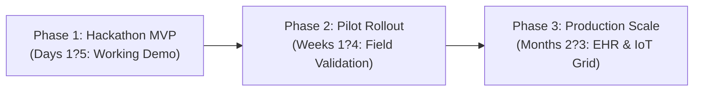

# ReferralOS: Hackathon Roadmap & Execution Plan

## 1. Hackathon Context & Scope

ReferralOS is designed and prototyped as a high-impact hackathon project developed in **less than one week (Days 1?5)**.

The objective of the hackathon sprint is to deliver a fully functional, end-to-end working prototype demonstrating capability-based referral routing, atomic capacity reservations, and automated mid-transit rerouting for acute clinical emergencies.



```
+-----------------------------------+     +-----------------------------------+     +-----------------------------------+
|              PHASE 1              |     |              PHASE 2              |     |              PHASE 3              |
|        Hackathon Core MVP         | --> |        Post-Hackathon Pilot       | --> |         Production Scale          |
|        (Days 1-5 / Current)       |     |            (Weeks 1-4)            |     |            (Months 2-3)           |
+-----------------------------------+     +-----------------------------------+     +-----------------------------------+
```

---

## 2. Phased Roadmap

### Phase 1: Hackathon Sprint (Days 1?5: Functional MVP)
*Focus: Delivering an end-to-end, testable clinical transfer demo for judging and live evaluation.*

- **Day 1 ? Foundation & Data Architecture:**
  - Scaffold repository, Docker Compose infrastructure (PostgreSQL 16 + PostGIS, Redis 7).
  - Define core clinical schemas (`Facility`, `CapacityResource`, `Referral`, `Reservation`, `TrackingEvent`).
  - Seed regional network dataset: 1 Primary Health Centre (St. Mary's) + 3 Regional Hospitals (Hospitals A, B, and C).
- **Day 2 ? Matching & Multi-Resource Reservation Engine:**
  - Build Phase 1 Hard Constraint binary filter (theatre, specialist, blood units, O2).
  - Implement Phase 2 composite scoring formula (travel time, resource depth, congestion penalty).
  - Implement atomic distributed multi-resource lock with Redis Redlock & 45-minute TTL.
- **Day 3 ? Electronic Pre-Arrival Packet (e-PRP) & Real-Time Dashboards:**
  - Build PHC emergency intake interface with pre-built clinical templates (PPH, Acute Trauma).
  - Build receiving hospital emergency room triage dashboard with live countdown ETA and audio siren alerts.
  - Implement WebSockets/SSE event stream for pre-arrival notifications.
- **Day 4 ? In-Transit Telemetry & The PPH Failover Demo:**
  - Build ambulance vehicle terminal simulator streaming live GPS coordinates and en-route patient vitals.
  - Implement the **Failover Watcher**: simulate sudden theatre failure at Hospital B, automatically invalidate lock, recalculate routing from live vehicle coordinates, secure locks at Hospital C, and trigger driver rerouting alarm.
- **Day 5 ? Polish, Verification & Pitch Preparation:**
  - End-to-end demo testing via CLI script (`npm run demo:pph-scenario`) and web UI.
  - Pitch deck, recorded product walkthrough, and hackathon submission assets.

---

### Phase 2: Post-Hackathon Pilot (Weeks 1?4: Field Validation)
*Focus: Hardening the system for real-world deployment in a pilot health cluster.*

- **Week 1 ? Low-Bandwidth & Offline Hardening:**
  - Progressive Web App (PWA) with local SQLite/IndexedDB caching for rural clinics with intermittent internet.
  - Twilio/Africa's Talking SMS and USSD fallback gateway for zero-data referral submission.
- **Week 2 ? Authentication & Multi-Tenancy:**
  - Role-Based Access Control (RBAC) with secure JWT and hospital staff account provisioning.
  - Granular audit logging conforming to regional patient data protection regulations.
- **Week 3 ? Real-World Hospital Integration:**
  - Onboard 1 pilot primary care cluster (10 rural health posts + 2 district hospitals).
  - Train triage nurses on the 1-click capacity status toggle board.
- **Week 4 ? Pilot Testing & Metric Evaluation:**
  - Run live simulated drills with local emergency transport providers.
  - Measure response times, referral acceptance rates, and usability feedback.

---

### Phase 3: Production & Scaling (Months 2?3: Interoperability & Automation)
*Focus: Scaling across the regional health network with automated telemetry.*

- **Month 2 ? EHR & Standards Interoperability:**
  - Full HL7 FHIR R4 API compliance for bi-directional synchronization with hospital electronic medical records.
  - National Health Information Exchange (NHIE) integration.
- **Month 3 ? Automated Telemetry & Smart Forecasting:**
  - IoT sensor integration: connect digital pressure transducers on hospital oxygen manifolds and generator controllers to automate capacity status.
  - Predictive bed availability heuristics based on average length of stay and elective surgical discharge schedules.

---

## 3. Hackathon Demo Checklist (What Judges Can Test Live)

Judges and evaluators can verify the complete ReferralOS value proposition in under 3 minutes:

| Test Step | Action | Expected Result | Verified In Demo |
|---|---|---|---|
| **1. Clinical Referral Intake** | Submit severe Postpartum Haemorrhage (PPH) case at St. Mary's PHC | System captures vitals, clinical shock index, and bundles required resources | Yes |
| **2. Dynamic Matching** | Run matching algorithm against regional hospital network | **Hospital A** (closer, 18 min) is rejected (theatre offline). **Hospital B** (38 min) is selected (all resources ready) | Yes |
| **3. Atomic Capacity Lock** | Confirm selection of Hospital B | 45-min lock placed on Theatre 3, Resus Bed 02, and 2x O- PRBC units; Hospital B ER screen sounds siren | Yes |
| **4. Live In-Transit Tracking** | Ambulance departs with GPS telemetry streaming | Real-time map shows vehicle movement and dynamic ETA updates | Yes |
| **5. Mid-Transit Failover** | Toggle Hospital B theatre status to `OFFLINE` during transit | Watcher invalidates Hospital B lock, instantly locks **Hospital C**, sounds reroute audio alarm on driver tablet, and updates GPS path | Yes |
| **6. Clinical Handshake** | Simulate arrival at Hospital C bay | QR scan verifies transfer, commits resources to `OCCUPIED`, and records audit trail | Yes |

---

## 4. Hackathon Evaluation Alignment

| Hackathon Criterion | How ReferralOS Delivers |
|---|---|
| **Impact & Relevance** | Tackles the leading cause of preventable emergency transit deaths by solving the "ping-pong" referral crisis in healthcare. |
| **Technical Execution** | Full-stack implementation featuring PostGIS spatial isochrones, Redis Redlock distributed resource locking, WebSockets, and event-driven failover watcher. |
| **Innovation** | Shifts healthcare routing from passive directories and distance-only navigation to active, capability-verified coordination. |
| **Completeness** | Working intake UI, hospital triage screen, ambulance telematics simulator, and automated rerouting engine. |
